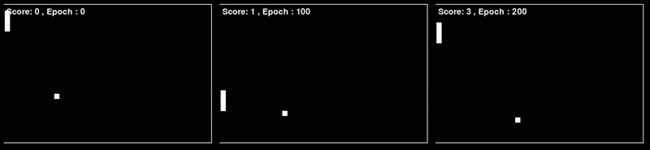

# Single Player Pong with Advanced Deep RL 🎮

<p align="center">
    
    <br>
    <em>Multiple agents playing Pong simultaneously at different training stages</em>
</p>

## 🎯 Overview

This project implements a single-player Pong game from scratch (without using OpenAI Gym) and trains an AI agent using advanced deep reinforcement learning techniques:

- 🧠 **Dueling DQN Architecture**
- 🔄 **Recurrent Deep Q-Learning (R2D2)**
- 🎮 **Custom Pygame Environment**
- 📈 **Multiple Training Modes**

## 🚀 Features

- **Built from Scratch**: Custom Pong environment using Pygame
- **Advanced RL Architecture**: 
    - Dueling networks for better value estimation
    - LSTM layers for temporal dependencies
    - Soft target network updates
- **Multiple Operation Modes**:
    - Training from scratch
    - Testing trained models
    - Retraining existing models
    - Multi-agent testing visualization

## 🛠 Installation

```bash
git clone https://github.com/RaphaelHaddad/RL_Pong_single_player/
```

## 🎮 Usage

### Different Modes

1. **Training Mode**
```python
# In main.py, set:
MODE = "train"
python main.py
```

2. **Testing Mode**
```python
# In main.py, set:
MODE = "test"
EPOCH_TEST = "path_to_your_model.pth"
python main.py
```

3. **Retraining Mode**
```python
# In main.py, set:
MODE = "retrain"
EPOCH_RETRAIN = "path_to_your_model.pth"
python main.py
```

4. **Multiple Test Mode**
```python
# In main.py, set:
MODE = "multiple_test"
# Configure CHECKPOINTS dictionary with model paths
python main.py
```

## ⚙️ Configuration

Key configurations can be modified in `config.py`:

```python
CONFIG = {
        'SCREEN_WIDTH': 600,
        'SCREEN_HEIGHT': 400,
        'BATCH_SIZE': 64,
        'SEQUENCE_LENGTH': 8,
        'LEARNING_RATE': 1.5e-3,
        # ... more configurations
}
```

## 🏗 Project Structure

```
.
├── main.py           # Main execution file
├── agent.py          # R2D2 agent implementation
├── pongEnv.py        # Custom Pong environment
├── R2D2.py          # Neural network architecture
├── config.py         # Configuration parameters
└── multipleTest.py   # Multi-agent testing implementation
```

## 📈 Performance

- Successfully learns to play Pong in ~200 episodes
- Achieves consistent scores above 100 points
- Demonstrates smooth paddle control and ball tracking


## 📄 License

MIT License - feel free to use this code for your own projects!
